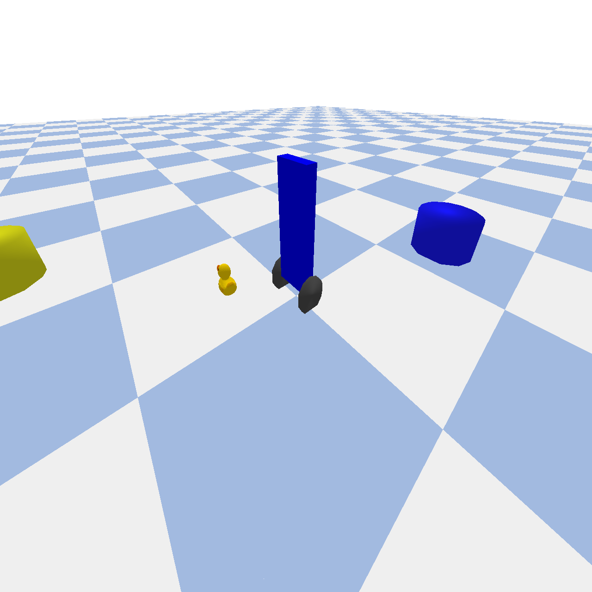

# Open Safety Gym
<div align="center">

</div>

# Project Mission

The objectives of this project are to: 

* Investigate questions about the validity of the [reward hypothesis](http://www.incompleteideas.net/rlai.cs.ualberta.ca/RLAI/rewardhypothesis.html) vs. the utility of breaking out scores for safety and reward separately. 
* Develop tools for building and training safe agents
* For yours truly to gain proficiency working with and on PyBullet physics engine and related robotics simulation practices.

This project was originally inspired by [OpenAI's safety gym](https://openai.com/blog/safety-gym/) and their work on constrained RL. I think that the dependence of OpenAI's safety gym on mujoco is a significant lack that leaves room for safety-focused environments in PyBullet, making investigating safe RL more available. I would also like to acknowledge [PyBullet](https://pybullet.org) (obviously) and [Backyard Robotics](https://backyardrobotics.eu/2017/11/27/build-a-balancing-bot-with-openai-gym-pt-i-setting-up/) for providing helpful resources. 

# Getting started

This repo can be set up as follows:

```
git clone git@github.com:riveSunder/OpenSafety.git
# initialize a virtual environment with your preferred virtual env manager, e.g.
virtualenv osg --python=python3
source osg/bin/activate
cd OpenSafety
pip install -e .
```

The environments in `OpenSafetyGym` use an API based on OpenAI's Safety Gym:

```
action = agent.get_action(obs)
obs, reward, done, info = env.step(action)
```

The safety score (aka cost) is returned in `info['cost']` 

You may also be interested in installing the (WIP) [SafeAgents repository](https://github.com/riveSunder/SafeAgents) in the same virtual environment, where I am working on evolving agents that respect safety constraints imposed by OpenSafetyGym.

```
cd ../
git clone git@github.com:riveSunder/SafeAgents.git
cd SafeAgents
pip install -e .
```

Then you can spin up a simple experiment, the call below sets up a training run under the assumption that the reward hypothesis is not sufficient for safety:

```
python safe_agents/train.py --algo es --env_name PuckEnvGoal0-v0 --constraint 1e-1 --reward_hypothesis Fals --pop_size 128 --view False --generations 100 --steps_per_episode 1000
```

# Tasks

Currently OpenSafetyGym is a work-in-progress and supports two task environments. You can train agents to avoid the (yellow) hazard cylinders while seeking the (blue) goal cylinders with either a balancing robot (introducing the additional safety constraint of staying upright) or a small hockey puck robot. 

<div align="center">

<br>
<em> Trying not to fall over.</em>
</div>

<div align="center">

<br>
<em> Puck looking for <del>love</del> a blue cylinder.</em>
</div>
