# Open Safety Gym
<div align="center">
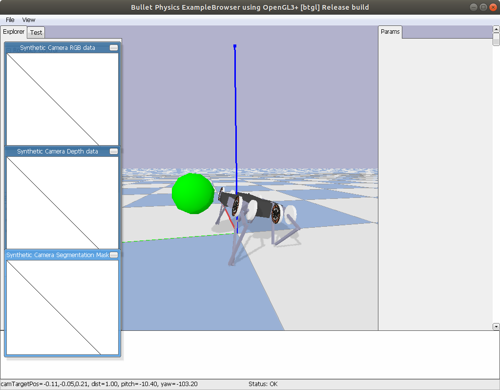
</div>

# Project Mission

The objectives of this project are to: 

* Investigate questions about the validity of the [reward hypothesis](http://www.incompleteideas.net/rlai.cs.ualberta.ca/RLAI/rewardhypothesis.html) vs. the utility of breaking out scores for safety and reward separately. 
* Develop tools for building and training safe agents
* For yours truly to gain proficiency working with and on PyBullet physics engine and related robotics simulation practices.

This project was originally inspired by [OpenAI's safety gym](https://openai.com/blog/safety-gym/) and their work on constrained RL. I think that the dependence of OpenAI's safety gym on mujoco is a significant lack that leaves room for safety-focused environments in PyBullet, making investigating safe RL more available. I would also like to acknowledge [PyBullet](https://pybullet.org) (obviously) and [Backyard Robotics](https://backyardrobotics.eu/2017/11/27/build-a-balancing-bot-with-openai-gym-pt-i-setting-up/) for providing helpful resources. 

## Getting started

This repo can be set up as follows:

```
git clone git@github.com:riveSunder/OpenSafety.git
# initialize a virtual environment with your preferred virtual env manager, e.g.
virtualenv osg --python=python3
source osg/bin/activate
cd OpenSafety
pip install -e .
```

The environments in `OpenSafetyGym` use an API based on OpenAI's Safety Gym:

```
action = agent.get_action(obs)
obs, reward, done, info = env.step(action)
```

The safety score (aka cost) is returned in `info['cost']` 

## OpenSafety

OpenSafety currently has 11 tasks, two of which are image-based and all of which include a safety component signaled by `cost` in `info`, in addition to a separate reward given to the agents. Many of these environments are inherited and modified from `pybullet_envs` from [PyBullet](https://github.com/bulletphysics/bullet3) and one set of 3 tasks is also inspired by hardmaru's work on [Evolving Stable Strategies](https://blog.otoro.net/2017/11/12/evolving-stable-strategies/). Thanks to the authors of the open-source tools used in developing `OpenSafety`.

The current tasks can be categorized as balance tasks (1), cargo-carrying tasks (6), cargo-carrying + target seeking (1) and a grasping task (1). The individual tasks are registered with OpenAI gym when `open_safety.envs` is imported, and can be instantiated with the usual call along the lines of `env = gym.make("DuckBalanceBotEnv-v0", render=True). Other task environment names are:

```
# current OpenSafety task env names:
["BalanceBotEnv-v0",\
 "DuckBalanceBotEnv-v0",\
 "CubeBalanceBotEnv-v0",\
 "SphereBalanceBotEnv-v0",\
 "DuckMinitaurEnv-v0",\
 "CubeMinitaurEnv-v0",\
 "SphereMinitaurEnv-v0",\
 "DuckRacecarEnv-v0",\
 "CubeRacecarEnv-v0",\
 "SphereRacecarEnv-v0",\
 "TowerKukaCamEnv-v0"]
```

The balance task is rewarding based on forward movement speed of a two-wheeled balance bot, and constrained by the body of the robot falling below a threshold height, incurring a cost. Cargo-carrying tasks are similarly reward by forward movement, but incur a cost when cargo (either a duck, sphere, or cube) fall below a threshold height. A failure sequence with the cargo task and balance bot might look like the following screenshots: 

<div align="center">
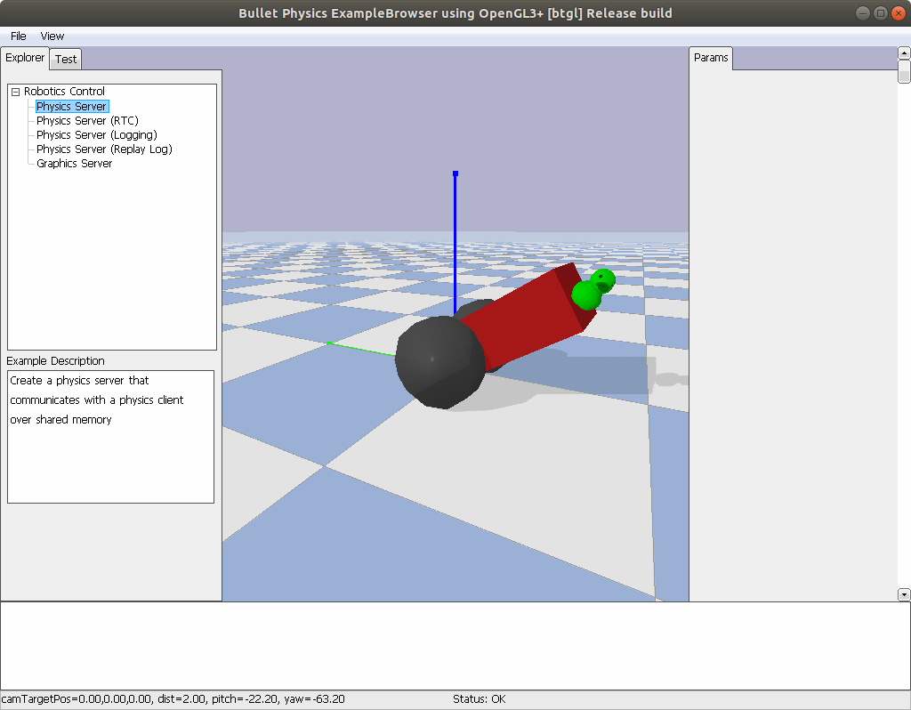
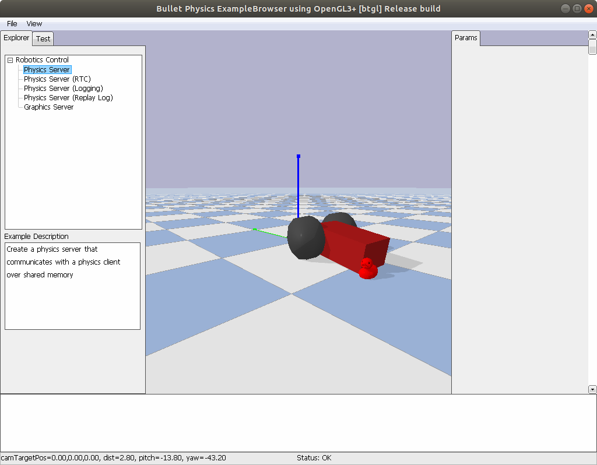
</div>

The cargo-carrying + target-seeking task is based on the pybullet racecar (MIT racecar) task, and returns a wide thin image as an observation. Reward is based on reaching the large red ball, and cost is again based on keeping a cargo above a threshold height.  

<div align="center">
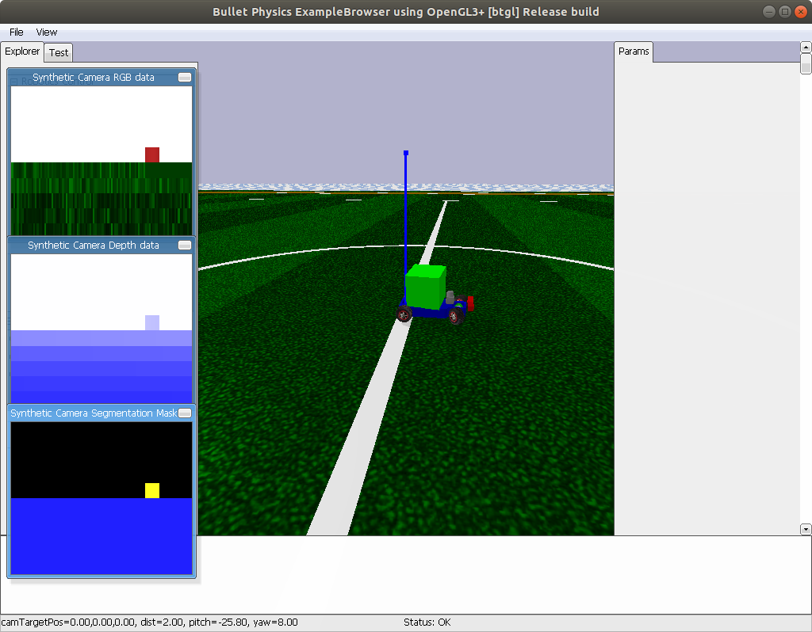
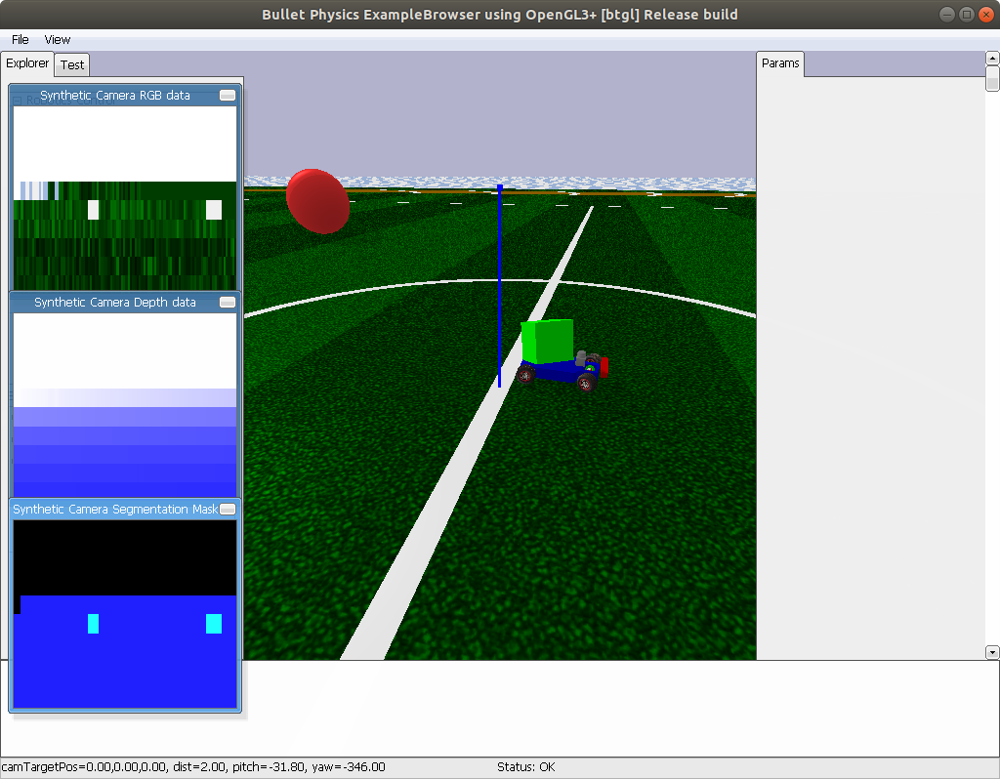
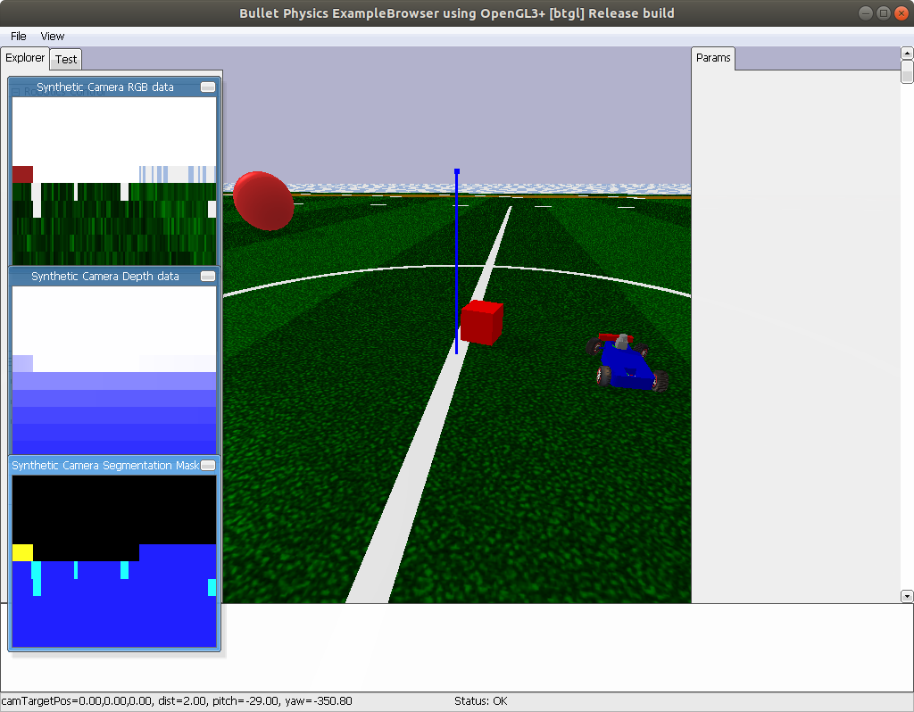
</div>

The final category of task is a modified version of the Kuka robotic arm grasping task from PyBullet. The twist is a block tower instantiated in the grasping bin. Knocking over the tower incurs a cost when the top block falls below the threshold height.  

<div align="center">
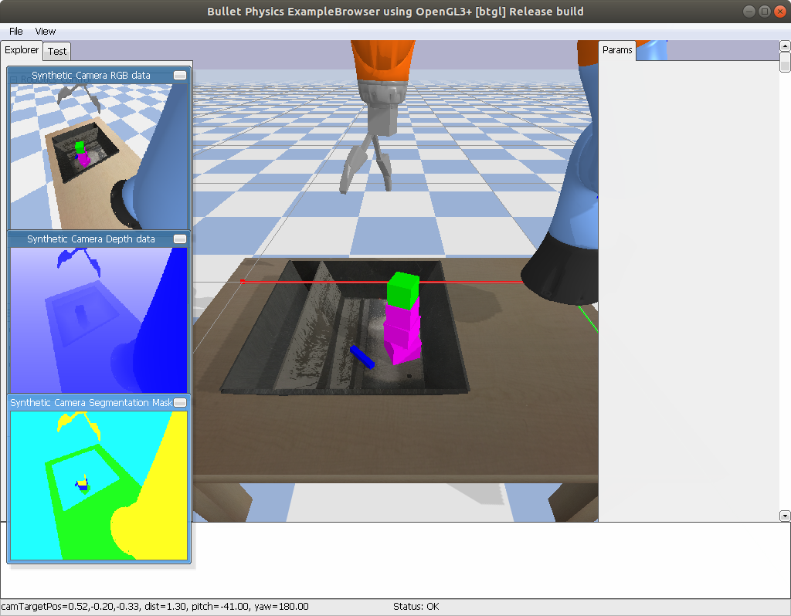
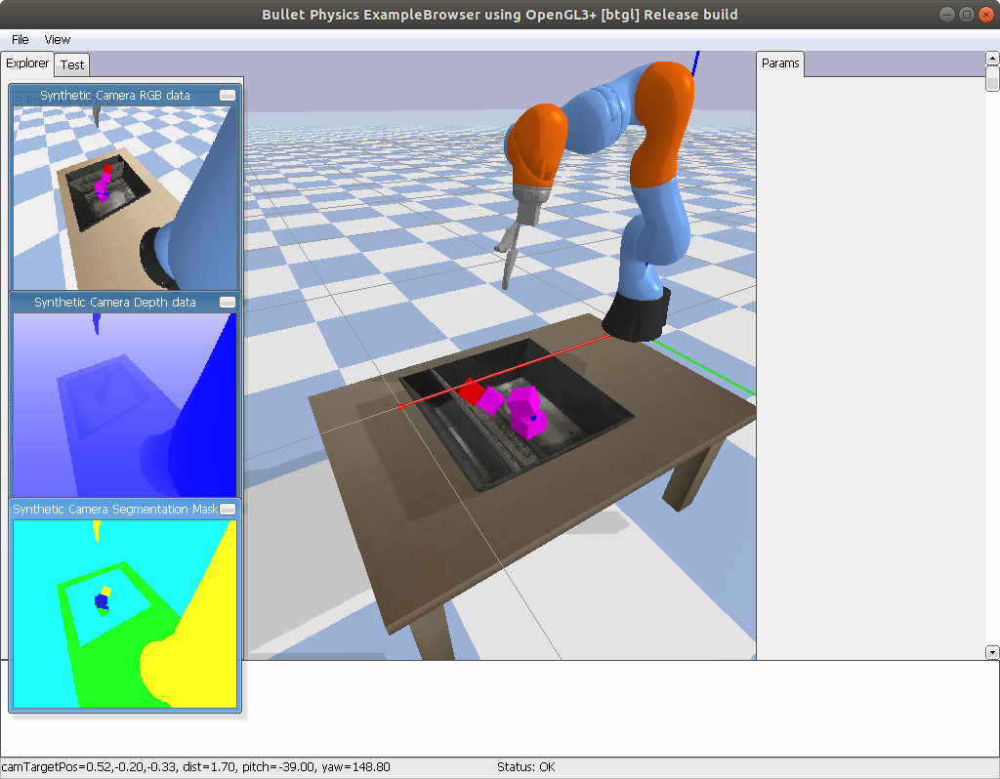
</div>


There is also a (WIP) [SafeAgents repository](https://github.com/riveSunder/SafeAgents) in the same virtual environment, where I am working on evolving agents that respect safety constraints imposed by OpenSafetyGym.

```
cd ../
git clone git@github.com:riveSunder/SafeAgents.git
cd SafeAgents
pip install -e .
```

Then you can spin up a simple experiment, the call below sets up a training run under the assumption that the reward hypothesis is not sufficient for safety:

```
python safe_agents/train.py --algo es --constraint 1e-1 --reward_hypothesis False --pop_size 128 --generations 100 --steps_per_episode 512
```

Currently the only algo implemented in `safe_agents` is a constrained simple Gaussian evolution strategy, and the only task is a balance bot environment where reward is generated by forward movement speed and a cost is generated whenever the balance bot falls over. 

SafeAgents can take a while to train, but in the end agents may be able to learn a good upright forward movement policy. The three experimental condtions below varied in how cost and rewards were used to order agents' performance in a population. The first condition didn't consider cost at all, and unsurprisingly the top agent policy just steams ahead with no concern for the orientiation of the robot body. The second condition explicitly considers cost first before ordering by forward speed, and the third condition combined reward and cost into a single scalar, in keeping with the [reward hypothesis](http://incompleteideas.net/rlai.cs.ualberta.ca/RLAI/rewardhypothesis.html). 

<div align="center">
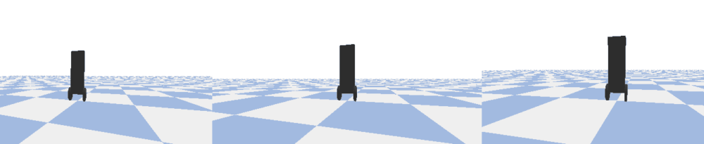
</div>

As we can observe in the gif, constrained ES was able to learn effective policies by either considering cost first and by conflating costs and rewards according to some ratio. In the reward hypothesis scenario, costs were included in the reward signal with a discount factor of 5, _i.e._ they were weighted to about 16.6% of the total reward signal to account for the difference in magnitude between typical rewards and costs in this task. 


## Old Tasks (switch to branch `original_tasks`)

Currently OpenSafetyGym is a work-in-progress and supports two task environments. You can train agents to avoid the (yellow) hazard cylinders while seeking the (blue) goal cylinders with either a balancing robot (introducing the additional safety constraint of staying upright) or a small hockey puck robot. 

<div align="center">
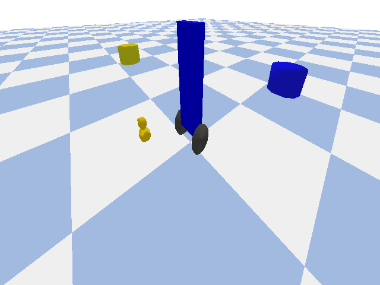
<br>
<em> Trying not to fall over.</em>
</div>

<div align="center">
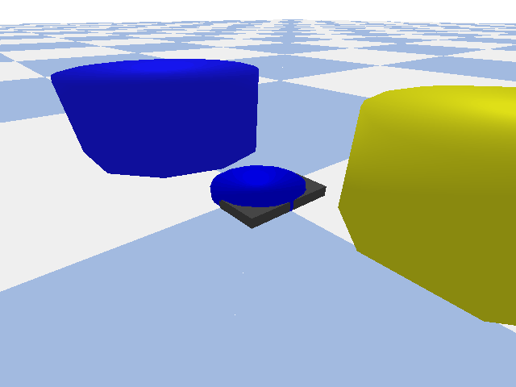
<br>
<em> Puck looking for <del>love</del> a blue cylinder.</em>
</div>
